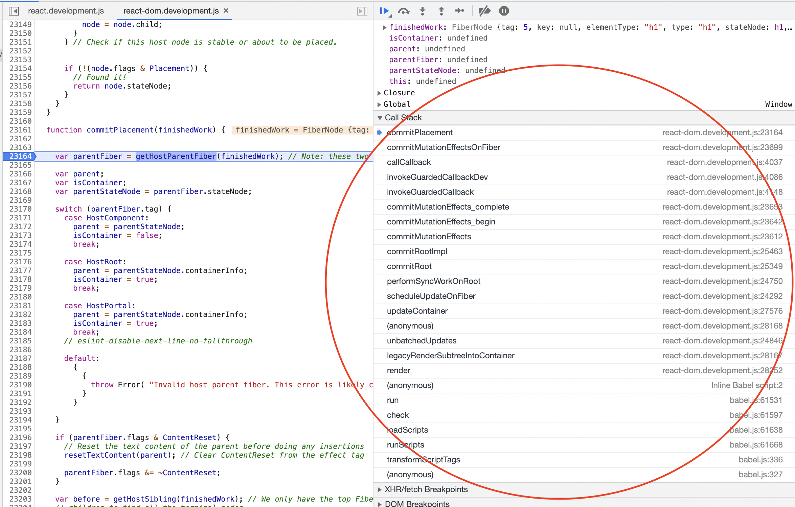

# 1. Debug Hello World.

Let's start with the classic Hello World program.

## 1.1 Setting Up

As React team has mentioned in [How to Contribute](https://reactjs.org/docs/how-to-contribute.html),
all you need to do is:

```
> git clone git@github.com:facebook/react.git`
> yarn build react/index,react-dom/index --type=UMD
```

Then open `fixtures/packaging/babel-standalone/dev.html` in Chrome, we can see the familiar Hello World.


1. development version of React and ReactDOM, built from yarn
2. babel.js to support JSX syntax
3. real DOM container holding Hello World
4. raw React code with JSX in `type="text/babel"`

Babel is used to transform JSX code on the fly, we could just ignore it.

How exactly does `Hello World!` become visible here?

## 1.2 Chrome Profiler

Open Chrome Dev Tool, and profile it, we can see a lot of work has been done. There is a lot of information in the profiler, but don't worry, we only use a small part of it.


The bars of colors mean some work being done, like a function call, most of the green area is code transformation from babel, we can ignore them.

On the right though, we can see the `render` function , which is the `ReactDOM.render()` we have in our HTML, let's zoom in this part.


As the arrows illustrate, the direction of the bars is **from top to bottom, then from left to right**. In the above chart,

1. the root call is `render`, which is the `ReactDOM.render()` in our HTML
2. in `render`, `legacyRenderSubtreeIntoContainer` is called
3. then in `legacyRenderSubtreeIntoContainer`, `legacyCreateRootFromDOMContainer` and `unbatchedUpdates` are called
4. ...

You can now easily understand the call tree, right? 

So the last call, which should update the real DOM, should be on the bottom right, seach on the chart, we find `commitPlacement`.

If you focus the bar, at the bottom the location of the function is displayed, let's follow the link - `commitPlacement @ react-dom.development.js:23161`

## 1.3 Set the breakpoints

Click the Source tab on Chrome Dev Tool, navigate to `react-dom.development.js` with `cmd(ctrol) + p`.

Then again type line number with colon `:23161` in the command box to go to `commitPlacement`.


We've found the final function call which alters the real DOM! Hooray! 

Let's set a breack point at the first line within it, then reload. Now program stops at the breakpoint and we can see the call stack on the right.



Cool! All the function calls from `render()` to `commitPlacement()` is listed. Click each of them to navigate.

You can then add breakpoints you want and see the data and understand the flow.

## 1.4 From Now On.

To understand the code, we need to know what each of the functions does. Let's list up the functions from profiler.

1. render()
2. legacyRenderSubtreeIntoContainer()
    1. legacyCreateRootFromDOMContainer()
        1. createLegacyRoot()
            1. ReactDOMLegacyRoot()
                1. createRootImpl()
                    1. createContainer()
                        1. createFiberRoot()
                            1. FiberRootNode()
                    2. listenToAllSupportedEvents()
                        1. listenToNativeEvent()
                        2. addTrappedEventListener()
    3. unbatchedUpdates()
        1. updateContainer()
            1. markRenderScheduled()
                1. formatLanes()
            2. scheduleUpdateOnFiber()
                1. schedulePendingInteractions()
                2. performSyncWorkOnRoot()
                    1. renderRootSync()
                        1. prepareFreshStack()
                        2. workLoopSync()
                            1. performUnitOfWork()
                                1. beginWork$1()
                                    1. beginWork()
                                        1. updateHostRoot()
                                            1. pushHostRootContext()
                                                1. pushHostContainer()
                                                    1. getRootHostContext()
                                            3. pushCacheProvider()
                                                1. pushProvider()
                                            5. reconcileChildren()
                                                1. reconcileChildFibers()
                                                    1. reconcileSingleElement()
                                                        1. createFiberFromElement()
                                        3. updateHostComponent()
                                3. completeUnitOfWork
                                    1. completeWork()
                                        1. createInstance()
                                            1. validateDOMNesting()
                                    2. finalizeInitialChildren()
                                        1. setInitialProperties()
                                            1. validatePropertiesInDevelopment()
                                                1. validateProperties()
                                                    1. warnInvalidARIAProps()     
                                                3. validateProperties$2()
                                                    1. warnUnknownProperties()
                    3. commitRoot()
                        1. commitRootImpl()
                            1. flushRenderPhaseStrictModeWarningsInDEV()
                            2. commitBeforeMutationEffects()
                                1. prepareForCommit()
                                2. commitBeforeMutationEffects_begin()
                                    1. commitBeforeMutationEffects_complete()
                                        1. invokeGuardedCallback()
                                            1. invokeGuardedCallbackDev()
                                                1. dispatchEvent()
                                                    1. Event: react-invokeguardedcallback
                            4. commitMutationEffects()
                                1. commitMutationEffects_begin()
                                    1. commitMutationEffects_complete()
                                        1. invokeGuardedCallback()
                                            1. invokeGuardedCallbackDev()
                                                1. dispatchEvent()
                                                    1. Event: react-invokeguardedcallback
                            6. commitLayoutEffects()
                                1. commitLayoutEffects_begin()


