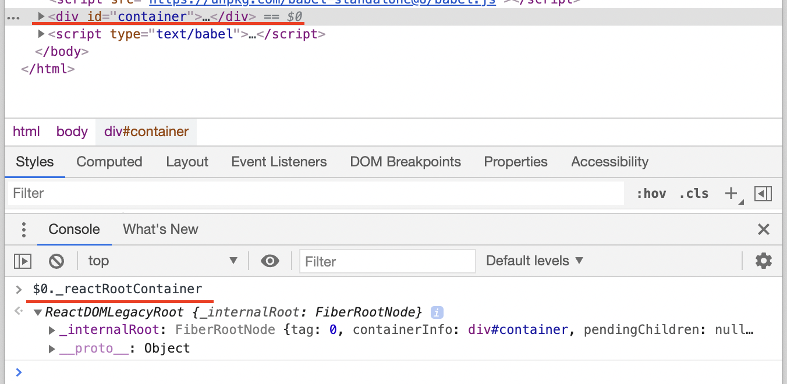

# legacyRenderSubtreeIntoContainer()

Here is the code : [ref](https://github.com/facebook/react/blob/12adaffef7105e2714f82651ea51936c563fe15c/packages/react-dom/src/client/ReactDOMLegacy.js#L175)

```js
function legacyRenderSubtreeIntoContainer(
  parentComponent: ?React$Component<any, any>,
  children: ReactNodeList,
  container: Container,
  forceHydrate: boolean,
  callback: ?Function,
) {
  if (__DEV__) {
    topLevelUpdateWarnings(container);
    warnOnInvalidCallback(callback === undefined ? null : callback, 'render');
  }

  // TODO: Without `any` type, Flow says "Property cannot be accessed on any
  // member of intersection type." Whyyyyyy.
  let root: RootType = (container._reactRootContainer: any);
  let fiberRoot;
  if (!root) {
    // Initial mount
    root = container._reactRootContainer = legacyCreateRootFromDOMContainer(
      container,
      forceHydrate,
    );
    fiberRoot = root._internalRoot;
    if (typeof callback === 'function') {
      const originalCallback = callback;
      callback = function() {
        const instance = getPublicRootInstance(fiberRoot);
        originalCallback.call(instance);
      };
    }
    // Initial mount should not be batched.
    unbatchedUpdates(() => {
      updateContainer(children, fiberRoot, parentComponent, callback);
    });
  } else {
    fiberRoot = root._internalRoot;
    if (typeof callback === 'function') {
      const originalCallback = callback;
      callback = function() {
        const instance = getPublicRootInstance(fiberRoot);
        originalCallback.call(instance);
      };
    }
    // Upate
    updateContainer(children, fiberRoot, parentComponent, callback);
  }
  return getPublicRootInstance(fiberRoot);
}
```

Let's break it down for easier explanation.

### 1. First check if it is initial mount or not.

```js
let root = container._reactRootContainer
let fiberRoot;
if (!root) {
  // initial mount
} else {
  // not intial mount, meaning update
}
```

React checks if `render()` on some DOM element is initial mount or not, by checking `_reactRootContainer`.

Meaning the container element in our code, there should exist this property, let's take a look.



Yes, there is. `reactRootContainer` is the root for the whole APP, so very important. We'd expect that changes within the react app would be reflected to DOM container by react, rather than manually.

Let's see how to create a one.

```js
if (!root) {
  // Initial mount
  root = container._reactRootContainer = legacyCreateRootFromDOMContainer(
    container,
    forceHydrate,
  );
  fiberRoot = root._internalRoot;
  ...
}
```

The root is created by `legacyCreateRootFromDOMContainer()`. As the name implies, there is/will be a new mechanism for this.

We don't need to dive into the details of `legacyCreateRootFromDOMContainer`, here we know that:

1. root is exposed as `_reactRootContainer`, it might have some methods but not used here.
2. the root has a fiberRoot as `root._internalRoot`, which seems important.

```js
if (typeof callback === 'function') {
  const originalCallback = callback;
  callback = function() {
    const instance = getPublicRootInstance(fiberRoot);
    originalCallback.call(instance);
  };
}
```

In our demo, we don't use callback. But the code is pretty simple, get the public root from fiberRoot, and trigger the callback against it.

Now the most important part:

```
if (!root) {
  // Initial mount should not be batched.
  unbatchedUpdates(() => {
    updateContainer(children, fiberRoot, parentComponent, callback);
  });
} else {
  // Upate
  updateContainer(children, fiberRoot, parentComponent, callback);
}
```

1. no matter the initial mount or not, `updateContainer` is always called
2. if initial mount, updateContainer is under `unbatchedUpdates()`.


By `batch`, we could infer that things are not updated right away but might be delayed for sometime. 
For the first render, we should show users the contents ASAP, so `unmatch`. For the updates, we could delay a little bit considering the smoothness.

Sounds reasonable! 

Let's take a look at `updateContainer()`


